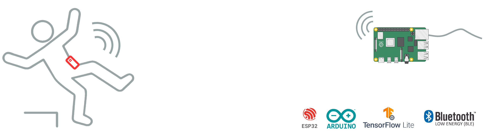
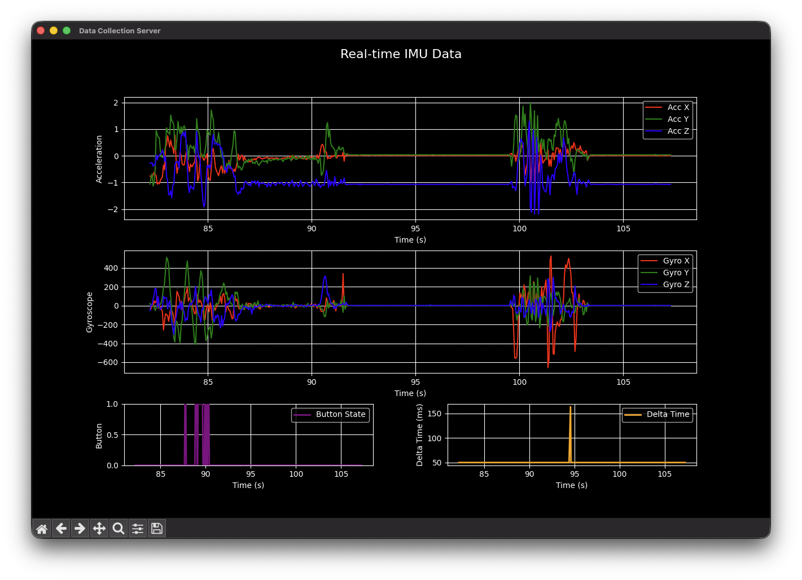
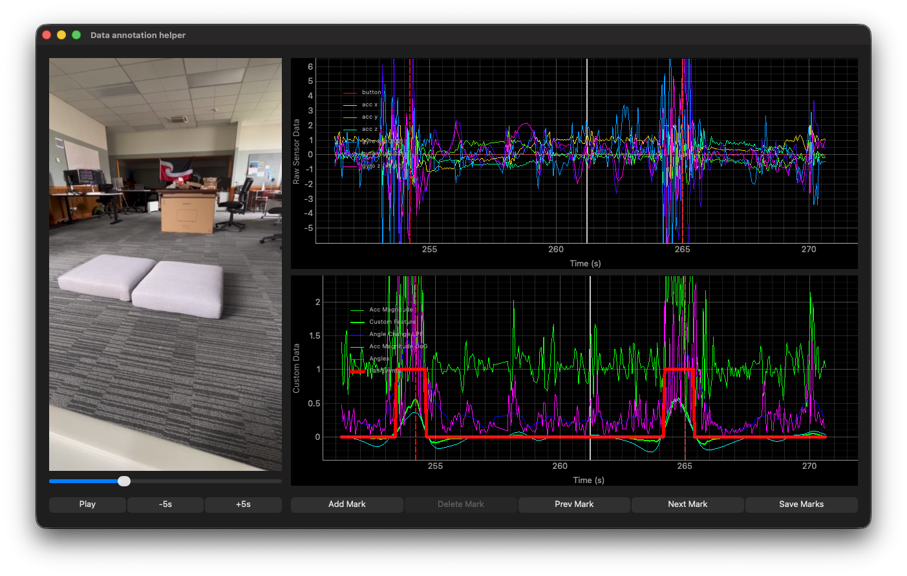

# Fall Detection on ESP32 with TensorFlow Lite and BLE

This project implements a fall detection system using an ESP32 microcontroller equipped with an IMU (Inertial Measurement Unit) sensor. The system collects motion data, and a naive threshold-based algorithm runs in real time to detect potential falls. Once a potential fall is detected, a TensorFlow Lite model is used to classify the event more accurately. If a fall is confirmed, the ESP32 begins a countdown, and if not cancelled, it sends a Bluetooth Low Energy (BLE) advertisement indicating that a fall has occurred.

## Building ESP32 Firmware
- `cd lib && git clone it@github.com:LiquidCGS/FastIMU.git`
- Other dependencies listed in `platformio.ini`.
- Use PlatformIO to build the project and flash it to the ESP32 device.

## Training the Model
- Required Python packages in pipfile (use `pipenv`)
- `cd python_src && python main.py`
- Trained model saved as `top_model.keras` in `python_src/models/`
- Converted TFLite model saved as `model.tflite` in `python_src/models/`
- Use `xxd -i model.tflite > model.cpp` to convert TFLite model to C++ source file for embedding in firmware.
- Copy `model.cpp` to `src/` directory of the firmware project.

### Data Collection Server
`python_src/data_collection_server.py`. Listens for live data streamed over Wifi from the wearable device, and displays real-time plots. Saves received data to CSV file for use in training.

### Data Annotation Helper
`python_src/annotate_data.py` Designed for manually annotating fall events in synchronized video and sensor data. Also displays custom metrics based on the data which was used to create the naive fall detection algorithm.

## Other tools
- To find the optimal parameters for the naive fall detection algorithm, use `python_src/experiments.py`. (Uses bayesian optimization to search parameter space.)
- Fall detection server: `python_src/fall_detection_server.py`. Listens for Bluetooth Low Energy "Fallen" advertisements from the wearable device, and flashes some very specific LEDs using the GPIO pins on my Raspberry Pi whenever a fall is detected. This could be extended to send push notifications to family members, or alert emergency services.
- Fall detection ESP32 code: `src/data_collection.cpp`. Periodically sends overlapping windows of IMU data to the data collection server over Wifi. This is unfortunately quite unreliable as packets are often lost. Requires "env.cpp" file with Wifi credentials.
